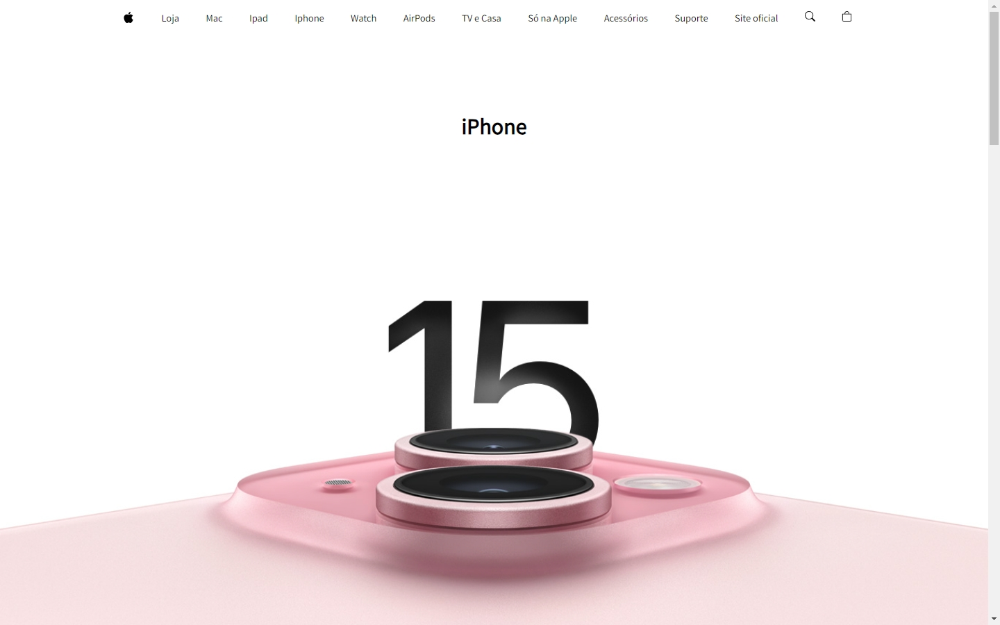
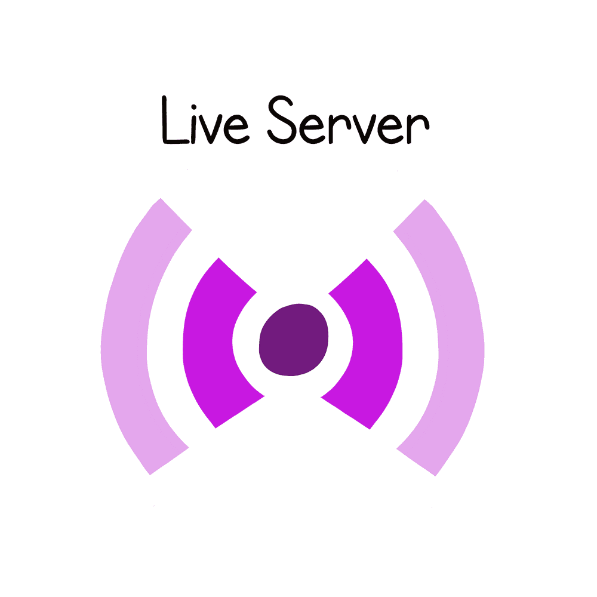
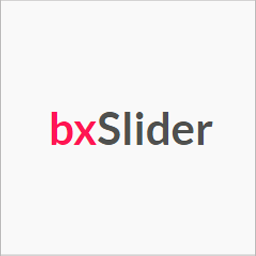
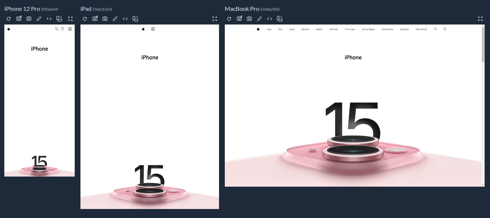

# iPhone 15

<div align="left">
  <div align="left">
  
  
  
  
  
</div>

###



> Página que criei para testar 2 plugins JavaScript: BxSlider e MagnificPopup .

## 🚀 Instalando

Windows:

```
git clone https://github.com/Joaommsp/Clone-Pagina-Iphone.git
```

```
cd Clone-Pagina-Iphone
```

```
use a extensão Live Server ou semelhante
```



## 💻 Um pouco do projeto


> Utilização de uma sessão de sliders usando o plugin BxSlider

<a href="https://bxslider.com/"></a>

> CLique na imagem para acessar a documentação


> Utilização do plugin na galeria de imagens que permite a ampliação da imagem e também uma navegação pela galeria

<a href="https://dimsemenov.com/plugins/magnific-popup/"></a>

> CLique na imagem para acessar a documentação




## 🔗 Deploy

Clique e acesse o projeto

<div align="left">
 <a href="https://joaommsp.github.io/Clone-Pagina-Iphone/"></a>
</div>

## 🤓 Me acompanhe para mais projetos
